<div align="center">

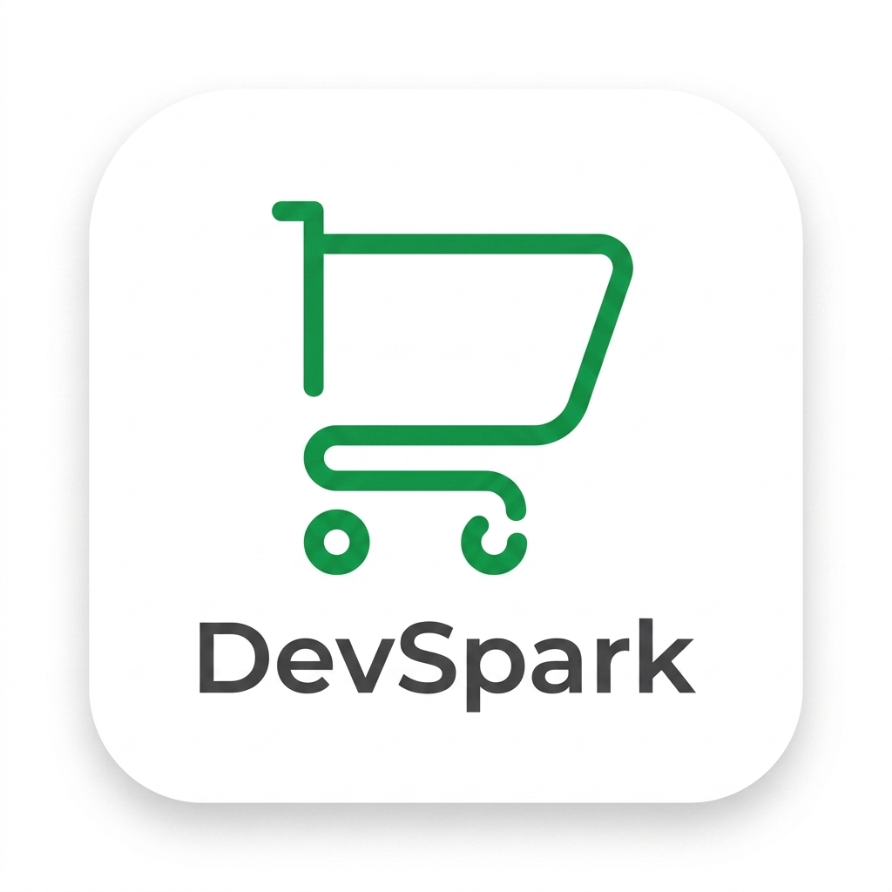

# ⚡ DevSpark

**Sistem Kasir Pintar (Point of Sale) Multi-Cabang & Real-Time Berbasis Android**

[](https://kotlinlang.org)
[](https://developer.android.com)
[](https://firebase.google.com)
[](https://m3.material.io)
[](https://github.com/bumptech/glide)

*Solusi kasir terpadu dan modern untuk mengelola transaksi penjualan, memantau multi-cabang bisnis, melacak inventori stok, dan menganalisis profitabilitas usaha secara instan.*

</div>

---

## 📋 Deskripsi

**DevSpark** adalah aplikasi **Point of Sale (POS) / Sistem Kasir** berbasis Android modern yang dirancang khusus untuk memenuhi kebutuhan bisnis retail, F&B, dan UMKM berskala multi-cabang. Dibangun menggunakan bahasa pemrograman **Kotlin** dan diintegrasikan dengan **Firebase Realtime Database** dan **Firebase Authentication**, DevSpark menyajikan sinkronisasi data yang instan, responsif, dan aman antara kasir di toko fisik dengan pemilik usaha.

Aplikasi ini menyederhanakan alur transaksi harian, mengotomatiskan pengelolaan stok barang, meminimalisir kesalahan manusia (*human error*), serta memberikan wawasan keuntungan (*profit analytics*) secara *real-time*. Dengan antarmuka berstandar **Material Design 3**, DevSpark menghadirkan pengalaman pengguna yang premium, estetik, dan interaktif.

---

## ✨ Fitur Unggulan Kompleks

Aplikasi DevSpark dilengkapi dengan serangkaian fitur tingkat lanjut yang dirancang untuk mendukung operasional bisnis secara menyeluruh:

### 1. 🔄 Sinkronisasi Transaksi & Pengurangan Stok Aman (*Concurrency-Safe*)
* Menggunakan fitur **Firebase Transactions (`runTransaction`)** untuk memperbarui kuantitas stok produk saat transaksi diselesaikan. Proses ini menjamin tidak terjadi *data race* (perselisihan jumlah stok) ketika beberapa kasir di cabang yang sama melakukan checkout produk yang sama secara bersamaan.
* Deteksi otomatis jenis produk tanpa batas (*unlimited*), membebaskan produk digital atau jasa dari pengurangan kuantitas stok fisik.

### 🏢 2. Arsitektur Multi-Cabang Terintegrasi (*Multi-Branch Scoping*)
* Seluruh entitas data utama seperti **Kategori**, **Produk/Menu**, **Pegawai (Kasir)**, dan **Pelanggan** di-scope secara spesifik berdasarkan ID Cabang (`idCabang`).
* Memungkinkan satu sistem basis data Firebase melayani banyak lokasi cabang sekaligus tanpa terjadi kebocoran data antar cabang. Pemilik bisnis dapat memantau seluruh cabang dari satu dasbor terpusat.

### 💰 3. Pelacakan Margin Keuntungan Otomatis (*Profit Tracking*)
* Sistem secara otomatis menghitung keuntungan kotor dan bersih secara dinamis pada setiap transaksi berdasarkan selisih harga jual dan harga beli dikalikan dengan kuantitas:
  $$\text{Keuntungan} = (\text{Harga Jual} - \text{Harga Beli}) \times \text{Qty}$$
* Membantu pemilik toko melihat margin keuntungan bersih secara langsung tanpa harus melakukan kalkulasi manual di akhir bulan.

### 🚨 4. Peringatan Stok Rendah & Notifikasi Pintar (*Smart Alert System*)
* Sistem memantau batas minimum stok barang secara *real-time*. Jika persediaan produk jatuh di bawah ambang batas kritis (stok < 5 unit), Firebase secara otomatis memicu generator notifikasi lokal untuk memperingatkan kasir agar segera melakukan *restock*.
* Riwayat aktivitas kasir direkam secara transparan di bawah sub-node `notifications` dan `histori` untuk keperluan audit operasional.

### 💳 5. Kalkulator Kasir Cepat & Multi Metode Pembayaran
* Dilengkapi antarmuka kalkulator kasir yang efisien dengan dukungan **Quick Cash Chips** (Uang Pas, Rp50.000, Rp100.000) untuk mempercepat transaksi tunai.
* Mendukung pencatatan berbagai metode pembayaran modern lainnya seperti **QRIS** (dilengkapi simulasi scan kode QR) dan **E-Wallet** terkemuka (GoPay, DANA, OVO, ShopeePay).

### 🖨️ 6. Pencetakan Struk / Nota Instan & Digital Receipt
* Setelah pembayaran dikonfirmasi, aplikasi menghasilkan struk belanja terstruktur yang dapat langsung dicetak menggunakan printer termal bluetooth atau disimpan sebagai bukti transaksi digital yang rapi.

### 🌓 7. Dual-Theme Engine (Dukungan Native Dark & Light Mode)
* Terintegrasi penuh menggunakan Android Material Components (`values-night`). Aplikasi mendukung perubahan tema secara dinamis mengikuti preferensi sistem operasi, memberikan kenyamanan mata kasir di kondisi pencahayaan rendah serta menghemat daya baterai perangkat OLED.

### 🌐 8. Bilingual Translation System (Bahasa Indonesia & Inggris)
* Didukung oleh lokalisasi bahasa bawaan (`values` untuk Bahasa Indonesia dan `values-en` untuk Bahasa Inggris). Aplikasi secara cerdas mendeteksi bahasa aktif pada sistem operasi Android perangkat dan secara otomatis menerjemahkan antarmuka pengguna tanpa memutus sesi transaksi.

### 🔋 9. Edge-to-Edge UI & Animasi Launching Interaktif
* Memanfaatkan teknologi Android modern `enableEdgeToEdge()` dan pengaturan *window insets* agar tampilan menyatu sempurna di belakang status bar dan bar navigasi sistem.
* Diperkaya dengan **Animasi Meluncur & Wobble Recoil** pada *Splash Screen* menggunakan gabungan `ObjectAnimator` dan `OvershootInterpolator` yang dinamis dan berkelas premium.

### 🔌 10. Konektivitas Printer Thermal Bluetooth & Cetak Nota Nirkabel
* Dilengkapi utilitas nirkabel khusus (`BluetoothPrinterHelper` & `BluetoothPermissionHelper`) yang mendukung pencetakan nota fisik secara instan lewat printer thermal Bluetooth 58mm/80mm. Menyediakan tata letak struk otomatis, garis pemisah dinamis, dan penanganan status koneksi printer secara *real-time* untuk operasional kasir yang mulus.

---

## 🛠️ Tech Stack

### Mobile Client (Android)
| Teknologi | Versi | Peran |
|-----------|-------|-------|
| **Kotlin** | v2.2.10 | Bahasa pemrograman utama berkinerja tinggi |
| **Android SDK** | Target 36 (Android 14/15/Q) | Landasan sistem operasi seluler |
| **Material Design 3** | v1.13.0 | Desain UI modern, komponen estetik, dan responsif |
| **AndroidX Core KTX** | v1.10.1 | Ekstensi Kotlin untuk pengembangan Android yang bersih |
| **Glide** | v4.16.0 | *Library* pemuatan dan pengoptimalan gambar produk |
| **AppCompat** | v1.6.1 | Menjamin kompatibilitas antarmuka pada OS versi terdahulu |
| **ConstraintLayout** | v2.1.4 | Pembuatan tata letak UI yang kompleks dan fleksibel |

### Backend & Cloud Infrastructure
| Teknologi | Peran |
|-----------|-------|
| **Firebase Realtime Database** | Penyimpanan basis data NoSQL berlatensi rendah untuk sinkronisasi data kasir secara langsung |
| **Firebase Authentication** | Pengamanan akun pegawai/kasir dengan sistem otentikasi terenkripsi cloud |
| **SaldoManager Utility** | Pengelolaan kalkulasi akumulasi saldo toko secara otomatis saat pembayaran sukses |

---

## 🚀 Cara Menjalankan Proyek

### Prasyarat Pengembangan
* Komputer dengan OS **Windows** (atau macOS/Linux).
* **Android Studio** versi terbaru (Ladybug atau yang lebih baru direkomendasikan).
* **JDK 17** atau versi terbaru.
* Koneksi internet aktif untuk sinkronisasi Gradle dan Firebase.

### 1. Kloning Repositori
Jalankan perintah berikut di terminal Anda untuk menyalin proyek ke lokal komputer:
```bash
git clone https://github.com/Byatarade/DevSpark.git
cd DevSpark
```

### 2. Hubungkan dengan Firebase Anda
1. Buka [Firebase Console](https://console.firebase.google.com/).
2. Buat proyek baru dengan nama **DevSpark** (atau nama pilihan Anda).
3. Daftarkan aplikasi Android baru dengan Package Name: `com.byatara.penjualandev`.
4. Unduh file konfigurasi **`google-services.json`**.
5. Letakkan file `google-services.json` tersebut ke dalam folder `/app/` proyek Anda:
   ```
   DevSpark/
   └── 📁 app/
       └── google-services.json  <-- Letakkan di sini
   ```
6. Di Firebase Console, aktifkan fitur **Authentication** (metode Email/Password) dan **Realtime Database**.

### 3. Konfigurasi Awal Gradle
Buka proyek **DevSpark** menggunakan **Android Studio**. IDE akan secara otomatis memicu proses *Gradle Sync* untuk mengunduh seluruh dependensi yang tertera di file `build.gradle.kts` dan `gradle/libs.versions.toml`.

### 4. Menjalankan Aplikasi
* Hubungkan perangkat Android fisik via USB Debugging, atau aktifkan Android Virtual Device (Emulator) di Android Studio.
* Klik tombol **Run 'app'** (`Shift + F10`) di bagian atas bar Android Studio.
* Aplikasi siap digunakan!

---

## 🔑 Akses Aplikasi

Aplikasi memiliki alur otentikasi mandiri terpadu demi keamanan data transaksi cabang:
1. **Registrasi Akun Baru**: Pengguna mendaftarkan akun pegawai/kasir melalui halaman *Register* dengan melengkapi nama, email, nomor telepon, password, serta menentukan cabang tempat bertugas.
2. **Login Akun**: Masuk menggunakan kredensial terdaftar untuk memuat data khusus sesuai ID Cabang pegawai secara otomatis.
3. **Penyimpanan Status Sesi**: Menggunakan proteksi Firebase Auth session, sehingga kasir tidak perlu berulang kali memasukkan password setiap kali membuka aplikasi.

---

## 📁 Struktur Folder Proyek

```
DevSpark/
├── 📁 app/
│   ├── 📁 src/
│   │   ├── 📁 main/
│   │   │   ├── 📁 java/com/byatara/penjualandev/
│   │   │   │   ├── 📁 adapter/          # Adapter RecyclerView untuk produk, keranjang, order, dll.
│   │   │   │   ├── 📁 cabang/           # Aktivitas dan dialog manajemen data Cabang Toko
│   │   │   │   ├── 📁 kategori/         # Aktivitas CRUD kategori produk
│   │   │   │   ├── 📁 model/            # Entitas model Firebase (Cabang, Order, Produk, dll.)
│   │   │   │   │   ├── ModelCabang.kt
│   │   │   │   │   ├── ModelHistori.kt
│   │   │   │   │   ├── ModelKategori.kt
│   │   │   │   │   ├── ModelNotification.kt
│   │   │   │   │   ├── ModelOrder.kt
│   │   │   │   │   ├── ModelOrderItem.kt
│   │   │   │   │   ├── ModelPegawai.kt
│   │   │   │   │   ├── ModelPelanggan.kt
│   │   │   │   │   └── ModelProduk.kt
│   │   │   │   ├── 📁 pegawai/          # Manajemen data staf / kasir toko
│   │   │   │   ├── 📁 pelanggan/        # Manajemen data pelanggan setia
│   │   │   │   ├── 📁 produk/           # Manajemen katalog produk / menu makanan & minuman
│   │   │   │   ├── 📁 util/             # Utilitas formatting Rupiah & asisten umum
│   │   │   │   ├── 📁 utils/            # SaldoManager dan utilitas status transaksi
│   │   │   │   ├── 📁 viewmodel/        # Manajemen state data dinamis UI
│   │   │   │   │
│   │   │   │   ├── Exit.kt              # Utilitas konfirmasi keluar aplikasi
│   │   │   │   ├── HistoriActivity.kt   # Riwayat jejak log aktivitas cabang
│   │   │   │   ├── LaporanActivity.kt   # Grafik & ringkasan omset penjualan harian/bulanan
│   │   │   │   ├── LoginActivity.kt     # Halaman otentikasi login masuk kasir
│   │   │   │   ├── MainActivity.kt      # Beranda Dasbor utama dan navigasi menu utama
│   │   │   │   ├── NotificationActivity.kt # Pusat notifikasi peringatan stok dan transaksi
│   │   │   │   ├── PembayaranActivity.kt # Proses checkout kasir dengan kalkulator tunai & e-wallet
│   │   │   │   ├── PrintHistoryActivity.kt # Riwayat struk tercetak
│   │   │   │   ├── ProfileActivity.kt   # Pengaturan data profil kasir aktif
│   │   │   │   ├── ReceiptActivity.kt   # Halaman struk digital akhir & simulasi print
│   │   │   │   ├── RegisterActivity.kt  # Halaman registrasi staf kasir baru
│   │   │   │   ├── SplashActivity.kt    # Layar sambutan awal aplikasi
│   │   │   │   └── TransaksiActivity.kt # Halaman utama transaksi POS (pilih produk & keranjang)
│   │   │   │
│   │   │   └── 📁 res/
│   │   │       ├── 📁 layout/           # Desain antarmuka XML layout (Activity, Row, Dialog)
│   │   │       └── 📁 values/           # Resourcestring, warna dinamis, dan tema Material 3
│   │   │
│   │   └── google-services.json         # File kredensial Firebase (sensitif)
│   └── build.gradle.kts                 # Konfigurasi dependensi modul aplikasi
│
├── 📁 Documentation/                    # Kumpulan tangkapan layar dokumentasi aplikasi
├── build.gradle.kts                     # Konfigurasi project-level gradle
├── settings.gradle.kts                  # Pendaftaran modul & repository gradle
└── gradle/libs.versions.toml            # Manajemen versi pustaka eksternal terpusat
```

---

## 🗄️ Arsitektur Database & Keamanan

### Entity Relationship Diagram (ERD) - Firebase Realtime Database
Meskipun Firebase menggunakan struktur NoSQL JSON Tree, hubungan relasional antar entitas di DevSpark dirancang dengan ketat demi menjaga keutuhan relasi master-transaksi:

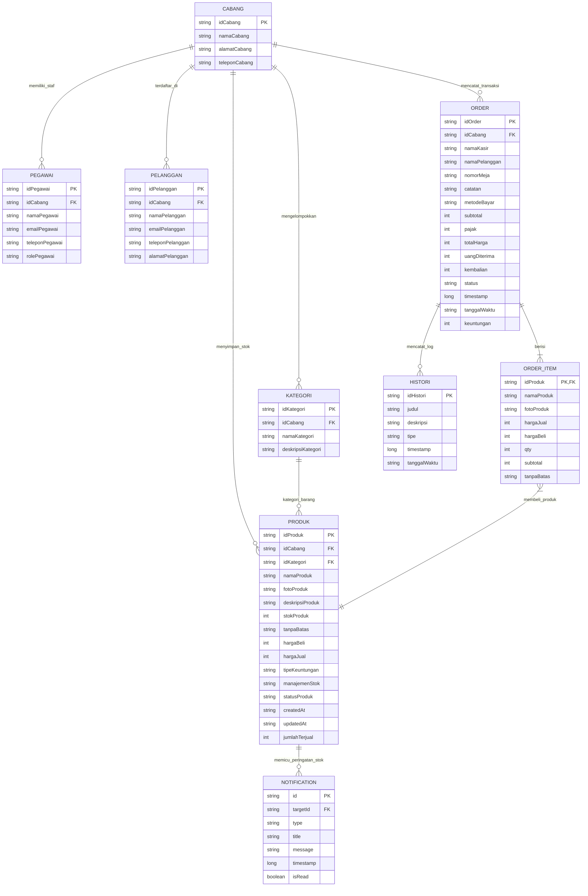

### 🔐 Sistem Keamanan Aplikasi
1. **Otentikasi Aman**: Registrasi dan verifikasi identitas kasir diproteksi sepenuhnya di sisi server oleh **Firebase Authentication**.
2. **Isolasi ID Cabang (*Data Isolation*)**: Query data pada aplikasi disaring ketat berdasarkan `idCabang` yang melekat pada akun kasir yang masuk. Hal ini mencegah kasir dari Cabang A untuk membaca atau memodifikasi data keuangan dan inventori di Cabang B.
3. **Integritas Stok via Firebase Database Rules**: Firebase Realtime Database dapat disematkan aturan validasi untuk memastikan nilai `stokProduk` tidak pernah diisi dengan nilai minus (`.validate: "newData.val() >= 0"`).

---

## 📸 Dokumentasi

Berikut adalah visualisasi antarmuka dari aplikasi **DevSpark** yang dikelompokkan secara terstruktur mulai dari halaman otentikasi hingga transaksi:

### 🔐 1. Autentikasi
Sistem otentikasi modern untuk memproteksi masuknya pegawai ke dasbor kasir.
<table>
  <tr>
    <td align="center" width="15%">
      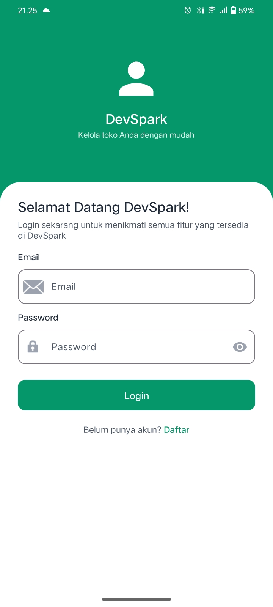
      <br/><sub><b>Halaman Login</b></sub>
    </td>
    <td align="center" width="15%">
      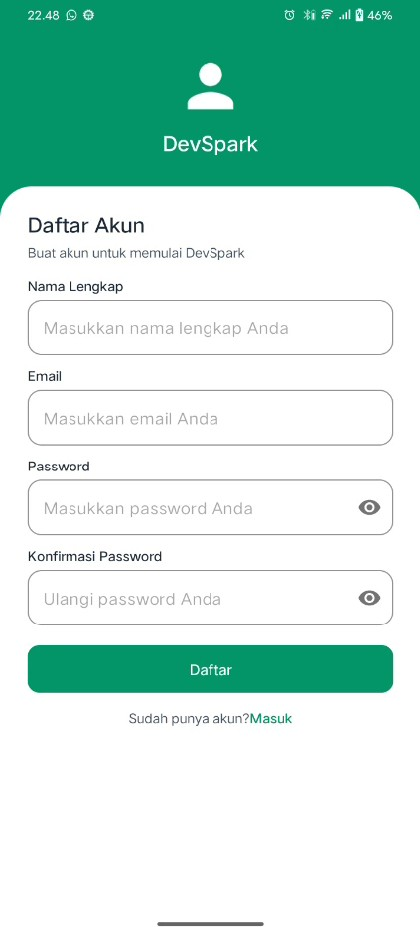
      <br/><sub><b>Halaman Registrasi Kasir</b></sub>
    </td>
  </tr>
</table>

### 🌐 2. Beranda View
Dasbor ringkasan performa cabang kasir, log histori, dan pusat notifikasi.
<table>
  <tr>
    <td align="center" width="20%">
      
      <br/><sub><b>Beranda Utama</b></sub>
    </td>
    <td align="center" width="20%">
      
      <br/><sub><b>Log Histori</b></sub>
    </td>
    <td align="center" width="20%">
      
      <br/><sub><b>Pusat Notifikasi</b></sub>
    </td>
    <td align="center" width="20%">
      
      <br/><sub><b>Profil Pengguna</b></sub>
    </td>
    <td align="center" width="20%">
      
      <br/><sub><b>Konfirmasi Keluar</b></sub>
    </td>
  </tr>
</table>

### 🏢 3. Manajemen Cabang
Pengelolaan data lokasi fisik dari cabang-cabang bisnis.
<table>
  <tr>
    <td align="center" width="17%">
      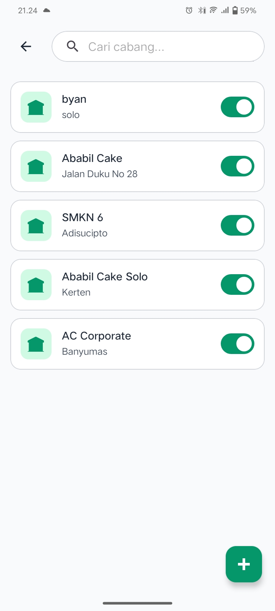
      <br/><sub><b>Daftar Cabang</b></sub>
    </td>
    <td align="center" width="17%">
      
      <br/><sub><b>Detail Informasi Cabang</b></sub>
    </td>
    <td align="center" width="17%">
      
      <br/><sub><b>Tambah Cabang Baru</b></sub>
    </td>
  </tr>
</table>

### 🏷️ 4. Manajemen Kategori
Pengorganisasian produk berdasarkan klasifikasi/kategori.
<table>
  <tr>
    <td align="center" width="17%">
      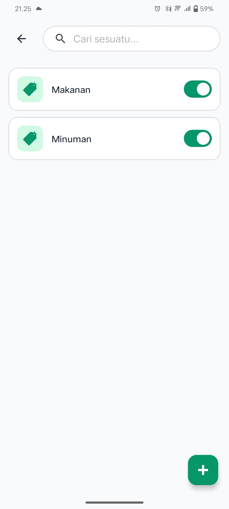
      <br/><sub><b>Daftar Kategori</b></sub>
    </td>
    <td align="center" width="17%">
      
      <br/><sub><b>Detail Kategori</b></sub>
    </td>
    <td align="center" width="17%">
      
      <br/><sub><b>Tambah Kategori Baru</b></sub>
    </td>
  </tr>
</table>

### 🍔 5. Manajemen Menu (Produk)
Katalog menu/produk dagang yang dijual lengkap dengan harga beli, harga jual, dan kontrol stok.
<table>
  <tr>
    <td align="center" width="17%">
      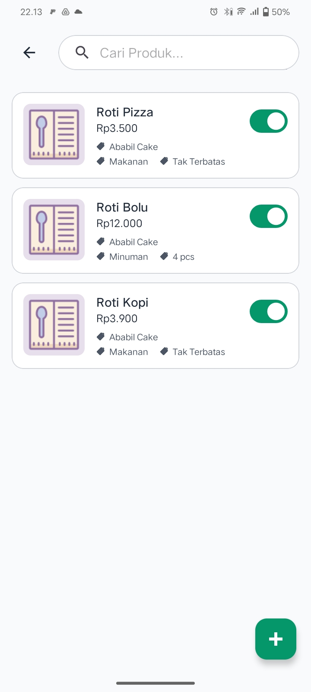
      <br/><sub><b>Daftar Menu & Produk</b></sub>
    </td>
    <td align="center" width="17%">
      
      <br/><sub><b>Detail Informasi Menu</b></sub>
    </td>
    <td align="center" width="17%">
      
      <br/><sub><b>Tambah Menu Baru</b></sub>
    </td>
  </tr>
</table>

### 👥 6. Manajemen Pegawai
Pengaturan keanggotaan staf kasir di setiap cabang bisnis.
<table>
  <tr>
    <td align="center" width="17%">
      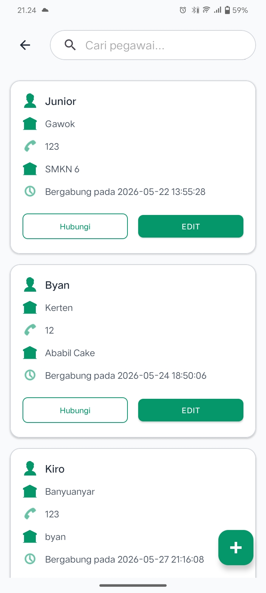
      <br/><sub><b>Daftar Pegawai</b></sub>
    </td>
    <td align="center" width="17%">
      
      <br/><sub><b>Detail Data Staf</b></sub>
    </td>
    <td align="center" width="17%">
      
      <br/><sub><b>Daftarkan Pegawai Baru</b></sub>
    </td>
  </tr>
</table>

### 🤝 7. Manajemen Pelanggan
Basis data identitas pelanggan loyal pendukung program loyalitas atau pencatatan transaksi terarah.
<table>
  <tr>
    <td align="center" width="17%">
      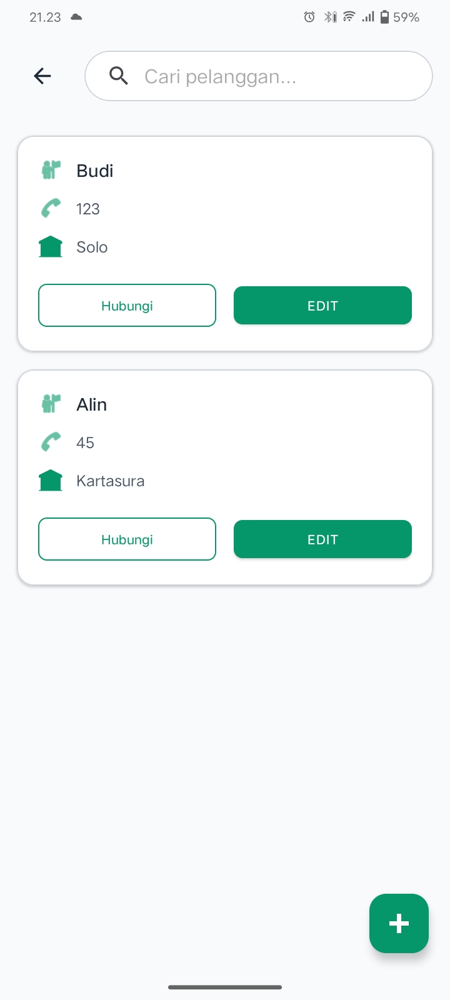
      <br/><sub><b>Daftar Pelanggan</b></sub>
    </td>
    <td align="center" width="17%">
      
      <br/><sub><b>Detail Pelanggan</b></sub>
    </td>
    <td align="center" width="17%">
      
      <br/><sub><b>Tambah Pelanggan Baru</b></sub>
    </td>
  </tr>
</table>

### 🛒 8. Alur Transaksi & Pembayaran
Proses POS yang sangat komprehensif mulai dari pemilihan produk, pengaturan profil kasir/pelanggan, hingga konfirmasi pembayaran multi-metode (Tunai/QRIS/E-Wallet).
<table>
  <tr>
    <td align="center" width="20%">
      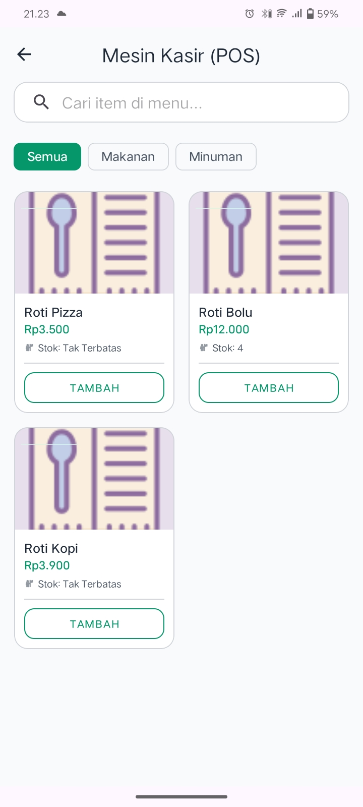
      <br/><sub><b>Katalog Belanja POS</b></sub>
    </td>
    <td align="center" width="20%">
      
      <br/><sub><b>Pilih Pelanggan</b></sub>
    </td>
    <td align="center" width="20%">
      
      <br/><sub><b>Pilih Pegawai</b></sub>
    </td>
    <td align="center" width="20%">
      
      <br/><sub><b>Keranjang Belanja</b></sub>
    </td>
    <td align="center" width="20%">
      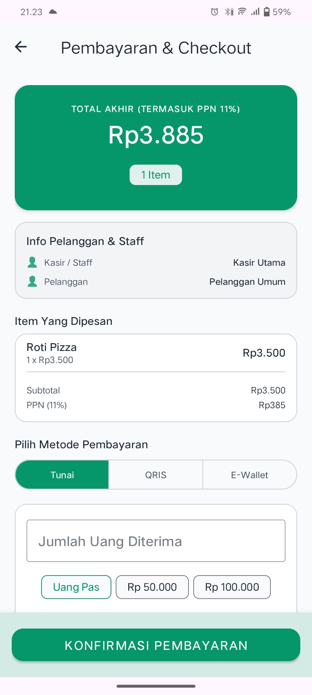
      <br/><sub><b>Metode Pembayaran</b></sub>
    </td>
  </tr>
  <tr>
    <td align="center" width="20%">
      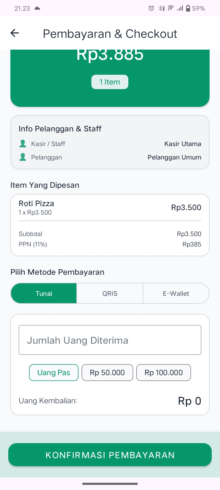
      <br/><sub><b>Kalkulator Tunai</b></sub>
    </td>
    <td align="center" width="20%">
      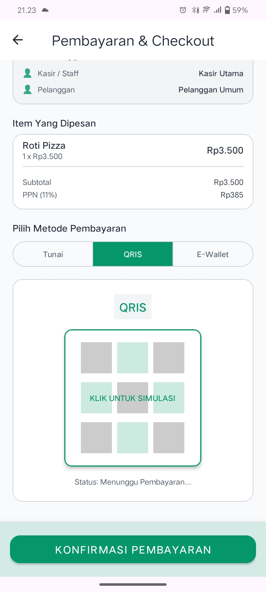
      <br/><sub><b>Simulasi Pembayaran QRIS</b></sub>
    </td>
    <td align="center" width="20%">
      
      <br/><sub><b>Pilihan E-Wallet</b></sub>
    </td>
    <td align="center" width="20%">
      
      <br/><sub><b>Ubah Staf/Pelanggan</b></sub>
    </td>
    <td align="center" width="20%"></td>
  </tr>
</table>

### 📊 9. Laporan & Rekap Penjualan
Statistik performa penjualan cabang harian/bulanan beserta omset kumulatif yang terdokumentasi.
<table>
  <tr>
    <td align="center" width="15%">
      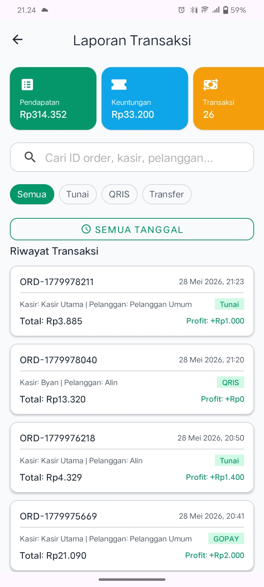
      <br/><sub><b>Dasbor Ringkasan Laporan</b></sub>
    </td>
    <td align="center" width="15%">
      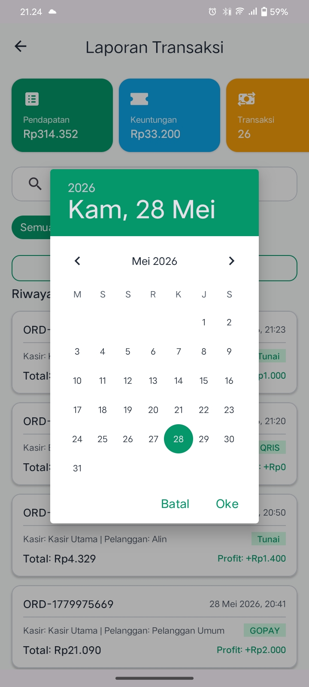
      <br/><sub><b>Filter Laporan per Rentang Tanggal</b></sub>
    </td>
  </tr>
</table>

### 🖨️ 10. Cetak Nota / Struk Bukti Bayar
Simulasi struk penjualan terstruktur siap cetak.
<table>
  <tr>
    <td align="center" width="15%">
      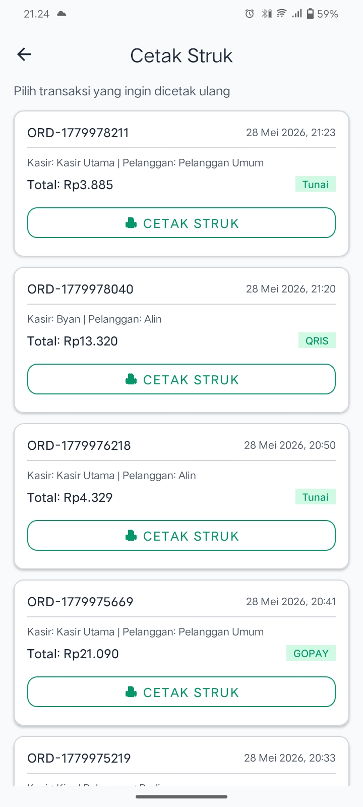
      <br/><sub><b>Halaman Struk Pembayaran</b></sub>
    </td>
    <td align="center" width="15%">
      
      <br/><sub><b>Struk Belanja Terstruktur</b></sub>
    </td>
  </tr>
</table>

---

## 🤝 Kontribusi

Kontribusi dari seluruh pengembang sangat kami hargai! Jika Anda ingin meningkatkan fungsionalitas DevSpark:

1. **Fork** repositori ini ke akun Anda: [Byatarade/DevSpark](https://github.com/Byatarade/DevSpark)
2. Buat **branch** fitur baru: `git checkout -b feature/NamaFiturKeren`
3. **Commit** perubahan Anda dengan pesan yang jelas: `git commit -m 'feat: menambahkan integrasi printer thermal bluetooth'`
4. **Push** ke branch Anda: `git push origin feature/NamaFiturKeren`
5. Ajukan **Pull Request (PR)** dan tunggu ulasan dari maintainer.

> Harap patuhi konvensi penulisan commit berstandar [Conventional Commits](https://www.conventionalcommits.org/en/v1.0.0/).

---

<div align="center">

Dibuat dengan dedikasi penuh menggunakan &nbsp;

&nbsp; dan &nbsp;

&nbsp; serta &nbsp;


**Created with ❤️ by [Byatarade](https://github.com/Byatarade)**
*Menghadirkan efisiensi dalam setiap kedipan transaksi.*

</div>
